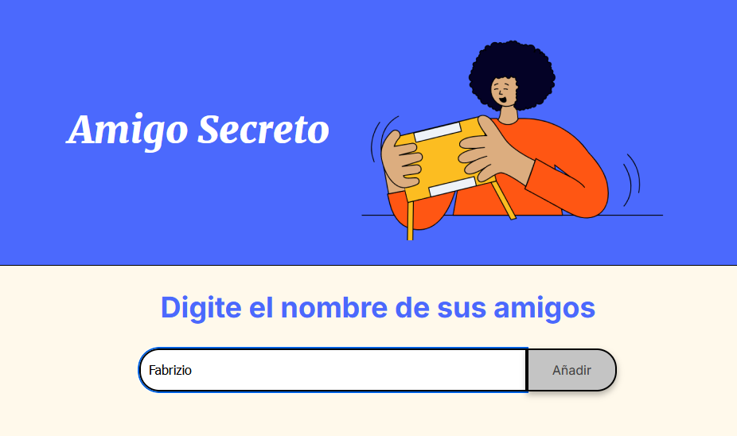

# Amigo Secreto

## Descripción

Esta es una aplicación web simple para realizar sorteos de "Amigo Secreto". Permite a los usuarios ingresar una lista de nombres y luego sortear aleatoriamente uno de ellos para determinar el amigo secreto.  Este proyecto fue creado como un ejercicio para practicar lógica de programación utilizando HTML, CSS y JavaScript.

## Funcionalidades

*   **Añadir nombres:** Los usuarios pueden ingresar nombres de amigos en un campo de texto y agregarlos a la lista haciendo clic en el botón "Añadir".
*   **Validación de entrada:** La aplicación valida que el campo de texto no esté vacío antes de añadir un nombre. Si se intenta añadir un nombre vacío, se muestra una alerta pidiendo un nombre válido.
*   **Visualizar la lista de nombres:** Los nombres añadidos se muestran en una lista debajo del campo de entrada.
*   **Sorteo aleatorio:** Al hacer clic en el botón "Sortear Amigo", la aplicación selecciona aleatoriamente un nombre de la lista.
*   **Mostrar el resultado del sorteo:** El nombre seleccionado como amigo secreto se muestra en la pantalla, indicando el resultado del sorteo.

## Cómo utilizar

1.  **Descarga los archivos:** Descarga o clona este repositorio que contiene los archivos `index.html`, `style.css`, `app.js` y la carpeta `assets` con las imágenes.
2.  **Abre `index.html` en tu navegador:** Simplemente abre el archivo `index.html` con cualquier navegador web (Chrome, Firefox, Safari, etc.). No se necesita instalación adicional ni servidor web.
3.  **Añade los nombres de tus amigos:**
    *   Encuentra el campo de texto que dice "Escribe un nombre".
    *   Ingresa el nombre de un amigo y haz clic en el botón "Añadir".
    *   Repite este paso para todos los amigos que quieras incluir en el sorteo. Los nombres aparecerán en la lista debajo del campo de entrada.

    
    *Ejemplo de cómo añadir nombres a la lista.*

4.  **Realiza el sorteo:**
    *   Una vez que hayas añadido todos los nombres, haz clic en el botón "Sortear amigo" que se encuentra en la parte inferior.

    
    *Botón para iniciar el sorteo.*

5.  **Visualiza el resultado:**
    *   Después de hacer clic en "Sortear amigo", el nombre del amigo secreto seleccionado aleatoriamente se mostrará en la sección de resultados.

    
    *Resultado del sorteo mostrando el amigo secreto.*

## Tecnologías utilizadas

*   **HTML:** Estructura y contenido de la página web.
*   **CSS:** Estilos visuales de la página web.
*   **JavaScript:** Lógica de programación para añadir nombres, validar la entrada y realizar el sorteo.

## Créditos

Desarrollado como un ejercicio de práctica de lógica de programación.

¡Disfruta sorteando tu Amigo Secreto!